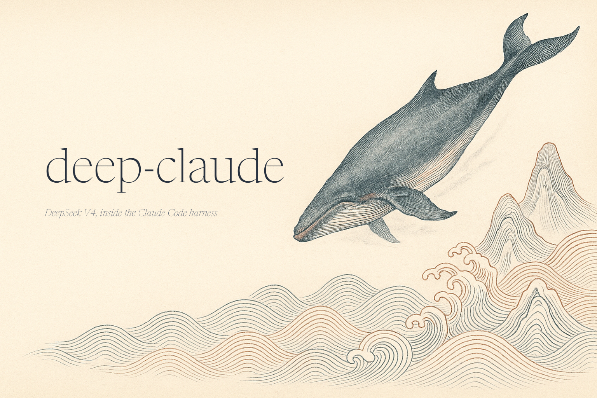

<p align="center">
  
</p>

<h1 align="center">deep-claude 🐋</h1>

<p align="center">
  <b>Drive Claude Code with any model.</b><br>
  OpenRouter by default — Gemini, GPT, DeepSeek, Grok, Qwen, Claude, and more — or any
  Anthropic-compatible endpoint you point it at. Same harness, a different mind, cleanly isolated.
</p>

<p align="center">
  <a href="https://dennisonbertram.github.io/deep-claude/">Website</a> ·
  <a href="#quickstart">Install</a> ·
  <a href="#usage">Usage</a> ·
  <a href="#personal-endpoints">Endpoints</a> ·
  <a href="#how-it-works">How it works</a> ·
  <a href="#troubleshooting">Troubleshooting</a>
</p>

<p align="center">
  <code>deep-claude</code> points <a href="https://claude.com/claude-code">Claude Code</a> at
  <a href="https://openrouter.ai">OpenRouter</a> through a tiny local proxy and redirects its state
  into a private home, so your real Anthropic login is never touched. Pick the models you want, then
  type <code>deep-claude</code> followed by any normal <code>claude</code> arguments — you get the full
  agentic harness (tools, MCP, slash commands, sub-agents) running on whichever model you chose.
</p>

```console
$ deep-claude pick                       # choose your models from OpenRouter's catalog
$ deep-claude -p "refactor this module and run the tests"
…the Claude Code agent loop you know — planning, editing, running — on your default model…

$ deep-claude --model opus -p "review this diff"          # switch model per run
$ deep-claude --endpoint deepseek --model deepseek-v4-pro # or hit a provider directly
```

## Why?

Claude Code is one of the best agentic coding harnesses there is: the planning loop, tool use, MCP
servers, sub-agents, permissions, and slash commands are all _harness_, not _model_. Lots of models
speak (or can be made to speak) the Anthropic API — so you can keep every bit of that machinery and
swap the brain.

- **One key, any model.** An OpenRouter key gets you Gemini, GPT, DeepSeek, Grok, Qwen, Claude, and
  hundreds more behind a single endpoint.
- **A curated, pretty picker.** `deep-claude pick` is a searchable, multi-select TUI over the whole
  catalog (with context windows and pricing). Your picks become Claude Code's `/model` list.
- **Real multi-model workflows.** A sub-agent's `model:` accepts a full model id, so one workflow can
  run many models at once — the orchestrator on one, sub-agents pinned to others.
- **Zero contamination.** Session history, projects, MCP config, and `~/.claude.json` live in a
  private state dir — your normal Claude Code setup is untouched, and `$HOME` is left alone so the
  macOS keychain keeps working.
- **Bring your own endpoint.** DeepSeek-direct, a local Ollama, a self-hosted gateway — any
  Anthropic-compatible URL is a [personal endpoint](#personal-endpoints) away.

> **Your normal setup is safe.** `deep-claude` only sets a few environment variables and redirects
> Claude Code's state directory per launch. It never reads, moves, or modifies your Anthropic credentials.

| Command                       | What it does                                                  |
| ----------------------------- | ------------------------------------------------------------ |
| `deep-claude`                 | Run Claude Code on your default model (first run: setup wizard). |
| `deep-claude --model X`       | Run on a specific model (alias or full id) for this session. |
| `deep-claude cli`             | The setup wizard — enter your key and pick models.           |
| `deep-claude pick`            | Interactive model picker over OpenRouter's catalog.          |
| `deep-claude models …`        | Curate the model set non-interactively.                      |
| `deep-claude endpoints …`     | Manage personal (non-OpenRouter) endpoints.                  |
| `deep-claude --endpoint NAME` | Run on a saved personal endpoint.                            |

## Contents

- [Requirements](#requirements)
- [Quickstart](#quickstart)
- [Configuring the key](#configuring-the-key)
- [Usage](#usage)
- [Personal endpoints](#personal-endpoints)
- [How it works](#how-it-works)
- [Troubleshooting](#troubleshooting)
- [Development](#development)

## Requirements

- **macOS or Linux**
- **[Claude Code](https://claude.com/claude-code)** — `claude` on `PATH`. Install via the [official installer](https://claude.com/claude-code) or `npm i -g @anthropic-ai/claude-code`.
- **[Node.js](https://nodejs.org/)** — the local proxy and the model picker run on `node`.
- **An [OpenRouter API key](https://openrouter.ai/keys)** for the default path (and/or a key for any personal endpoint you add).

## Quickstart

```bash
git clone https://github.com/dennisonbertram/deep-claude
cd deep-claude
./install.sh
export PATH="$HOME/.local/bin:$PATH"     # if it isn't already
```

Then just run it — the **first run walks you through setup** (enter your [OpenRouter key](https://openrouter.ai/keys), then pick your models):

```bash
deep-claude              # first run → setup wizard, then starts the session
```

You can re-run the wizard any time with `deep-claude cli`, change models with `deep-claude pick`, and prefer a different default with `deep-claude --model <alias>`.

## Configuring the key

`deep-claude` looks for `OPENROUTER_API_KEY` in this order:

1. **Shell environment** — `export OPENROUTER_API_KEY="sk-or-..."`
2. **`.env` next to this repo** — `cp .env.example .env && $EDITOR .env`
3. **macOS Keychain** — `security add-generic-password -s deep-router -a openrouter -U -w`

### Keychain details (macOS)

- Service: `deep-router` — Account: `openrouter`
- The `security` binary handles all reads, so the key never lives in `.env`, shell history, or process listings.
- First read after a reboot may show a Keychain prompt. Click **Always Allow** once and subsequent calls are silent.
- Rotate: re-run the `add-generic-password` command (`-U` updates in place). Inspect: `security find-generic-password -s deep-router -a openrouter -w`.

## Usage

### Pick your models

```bash
deep-claude pick
```

```
  Select models to expose  (these appear in Claude Code’s /model picker)
  17/337 models  ·  2 selected
  search: gemini▏

  ◉ google/gemini-2.5-flash      1.0M  $0.30/$2.50   Google: Gemini 2.5 Flash
> ◉ google/gemini-2.5-pro        1.0M  $1.25/$10     Google: Gemini 2.5 Pro
    ↑/↓ move · space select · type to search · ↵ confirm · esc cancel
```

The picker writes `ROUTER_MODELS` / `ROUTER_ALIASES` / `ROUTER_DEFAULT_MODEL` to `.env`. Curate non-interactively if you prefer:

```bash
deep-claude models add google/gemini-3.5-flash      gemini   # id + optional alias
deep-claude models add anthropic/claude-opus-4.8    opus
deep-claude models default gemini
deep-claude models list
deep-claude models remove opus
```

(Model ids change over time — check [openrouter.ai/models](https://openrouter.ai/models) for current slugs.)

### Run

```bash
deep-claude                                # default model (ROUTER_DEFAULT_MODEL)
deep-claude --model opus                   # by alias
deep-claude --model x-ai/grok-4.1          # or a full OpenRouter id
deep-claude -p "explain this repo"         # non-interactive
deep-claude --model gemini -- -p "hi"      # -- stops deep-claude's own option parsing
```

### Switching models inside a session

Claude Code's in-session `/model` picker is Claude-centric — its gateway discovery only surfaces `anthropic/*` models. So `deep-claude pick` also lets you **assign your models to Claude Code's switch slots** (Default + Fable/Opus/Sonnet/Haiku). Those slots accept *any* provider, so after assigning (say) Gemini→Opus and Grok→Sonnet, you can flip between them mid-session with `/model` (the rows are labelled "Custom Opus/Sonnet/Haiku model" but point at whatever you assigned).

Three ways to reach your models, then:

- **`/model`** — your slot-assigned models (any provider) + any Claude models (gateway).
- **`deep-claude --model <alias>`** — launch a session on *any* of your curated models.
- **Sub-agents** — a sub-agent's `model:` frontmatter can pin *any* model in your set; the orchestrator and sub-agents run on different models concurrently (verified end-to-end via the proxy).

Everything other than `deep-claude`'s own flags passes straight through to `claude`.

### Use your existing Claude setup (skills, plugins, MCP, …)

By default deep-claude runs in an isolated config, so it doesn't see your real `~/.claude`. To bring your **skills, agents, workflows, rules, hooks, plugins, `settings.json`, `CLAUDE.md`, and MCP servers** into the session:

```bash
deep-claude --inherit            # one run
# …or persist it:
echo 'DEEP_CLAUDE_INHERIT="1"' >> .env
```

It symlinks those config dirs/files and merges your MCP servers (from `~/.claude.json`) into the isolated home — but **never imports your Anthropic login or chat history**, so it can't conflict with the OpenRouter routing. Your real `~/.claude` is only read; deep-claude's own session history stays separate.

> **Non-Claude reasoning models:** OpenRouter's Anthropic skin emits (out-of-order) `redacted_thinking`
> blocks for models like Gemini, which would otherwise make Claude Code show an empty response. The
> proxy strips those blocks for non-`anthropic/` models so the visible text comes through; genuine
> Claude models pass through untouched. Disable with `ROUTER_KEEP_THINKING=1`.

## Personal endpoints

OpenRouter is the default, but any **Anthropic-compatible** endpoint — DeepSeek-direct, a local
Ollama, a self-hosted gateway — is a second-tier option. Save one and reuse it:

```bash
deep-claude endpoints add deepseek https://api.deepseek.com/anthropic DEEPSEEK_API_KEY
deep-claude endpoints add ollama   http://localhost:11434             # no key needed
deep-claude endpoints list

deep-claude --endpoint deepseek --model deepseek-v4-pro
deep-claude --endpoint ollama   --model qwen3-coder -p "write a test"
```

The third argument names the **environment variable** holding that endpoint's key (resolved from your
shell or `.env`). Or skip the save and pass it inline:

```bash
deep-claude --base-url https://api.deepseek.com/anthropic --api-key-env DEEPSEEK_API_KEY \
  --model deepseek-v4-pro -p "hello"
```

Personal endpoints talk to the provider **directly** (no proxy, no model picker, no thinking-strip).
A note on DeepSeek specifically: routing it *through* OpenRouter doesn't improve privacy — OpenRouter
becomes an additional party. Use a personal endpoint when you want the fewest hops or a provider
OpenRouter doesn't carry.

## How it works

**OpenRouter mode (default).** `deep-claude` boots a tiny local proxy (`bin/deep-claude-proxy`, no
dependencies beyond `node`) in front of OpenRouter's native Anthropic Messages endpoint, then points
Claude Code at it:

```
ANTHROPIC_BASE_URL=http://127.0.0.1:8787      # the local proxy
ANTHROPIC_AUTH_TOKEN=router                   # the proxy injects your real OpenRouter key
CLAUDE_CODE_ENABLE_GATEWAY_MODEL_DISCOVERY=1  # /model picker = your curated set
```

The proxy resolves model aliases, enforces your curated allow-list, injects the server-side OpenRouter
key, strips the Anthropic-only `context_management` field (which 400s on non-Claude models), and strips
the out-of-order `redacted_thinking` blocks described above.

**Personal-endpoint mode.** `deep-claude --endpoint …` / `--base-url …` sets `ANTHROPIC_BASE_URL` to
the endpoint and talks to it directly — no proxy.

**State isolation (both modes).** Claude Code's state — session history, projects, MCP config,
`~/.claude.json` — is redirected via `CLAUDE_CONFIG_DIR` and the XDG dirs into `<repo>/.deep-claude-home/`,
so your real `~/.claude/` is untouched. `$HOME` is deliberately left alone so the macOS login keychain
keeps working.

### Files

| Path                     | Purpose                                                              |
| ------------------------ | ------------------------------------------------------------------- |
| `bin/deep-claude`        | The one command: run, `cli`, `pick`, `models`, `endpoints`.         |
| `bin/deep-claude-cli`    | The Node first-run setup wizard (key entry + picker) (internal).    |
| `bin/deep-claude-proxy`  | The Node Anthropic→OpenRouter passthrough proxy (internal).         |
| `bin/deep-claude-pick`   | The Node interactive model picker (internal).                       |
| `deep-claude`            | Top-level shim that `exec`s `bin/deep-claude`.                      |
| `install.sh`             | Symlinks `deep-claude` into `~/.local/bin`.                         |
| `test.sh`                | Syntax checks, arg-passthrough, CLI, and live proxy tests.          |
| `.env.example`           | Template; copy to `.env` for keys, the curated set, and endpoints.  |
| `.deep-claude-home/`     | gitignored; isolated Claude Code state.                             |

## Troubleshooting

**`deep-claude: missing OPENROUTER_API_KEY`**
No key in shell env, `.env`, or Keychain (service `deep-router`, account `openrouter`). See [Configuring the key](#configuring-the-key).

**`deep-claude: no model selected`**
You haven't picked any models yet. Run `deep-claude pick` (or `deep-claude models add <id> <alias>`), or pass `--model <id>` explicitly.

**A non-Claude model returns an empty response**
That's the out-of-order `redacted_thinking` quirk — the proxy strips it for non-`anthropic/` models by default. If you've set `ROUTER_KEEP_THINKING=1`, unset it. (Personal endpoints don't strip; use OpenRouter mode for non-Claude reasoning models.)

**Keychain prompt appears repeatedly**
Click **Always Allow** once. macOS pins the access ACL to the `security` binary, so subsequent reads are silent — even across reboots.

**Argument passthrough confusion**
`deep-claude` eats its own flags (`--model`, `--endpoint`, `--base-url`, …); everything else passes through. Use `--` to be explicit: `deep-claude --model gemini -- -p "hello"`.

**See what would run without running it**
```bash
CLAUDE_BIN=/bin/echo deep-claude --base-url http://x --api-key k --model m -p hi
# prints: --model m -p hi
```

## Development

```bash
./test.sh
```

The tests use `CLAUDE_BIN=/bin/echo` to verify argument handling without invoking real binaries, and
spin up a fake upstream to exercise the proxy. They cover:

- Bash syntax (`bash -n`) and `node --check` for every script
- Run-arg handling for OpenRouter and personal-endpoint modes (incl. the `--` separator)
- The `models` and `endpoints` curation CLIs
- Proxy behavior: alias resolution, `context_management` stripping, beta-header sanitizing, key injection, and thinking-block stripping for non-Claude models

## License

MIT — see [LICENSE](LICENSE).
